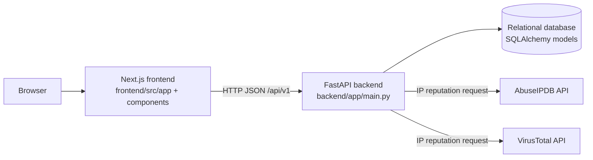
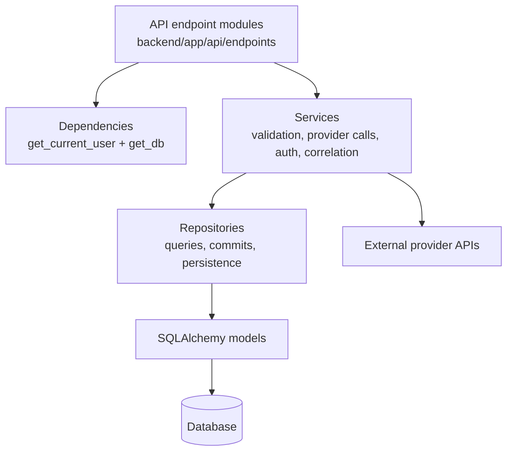
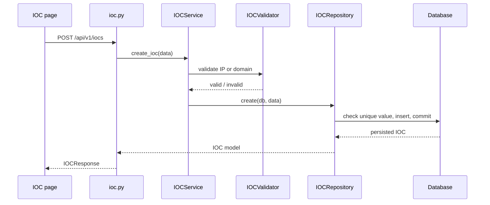
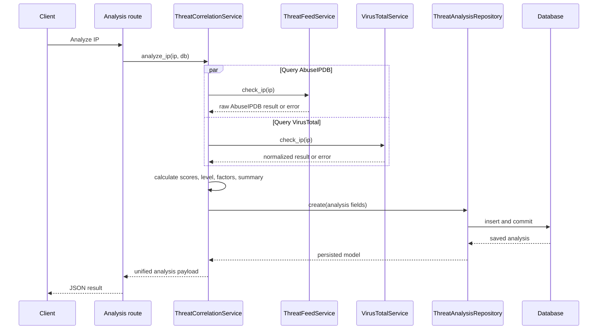

# ThreatLens AI Architecture

This document describes the architecture currently implemented in the repository. It is intended as a practical map for developers working on the Next.js console, FastAPI API, persistence layer, or threat-intelligence integrations.

## 1. High-Level System Architecture

ThreatLens AI is a two-tier web application:

- The **frontend** is a Next.js App Router application. It renders the security console and calls the backend over HTTP.
- The **backend** is a FastAPI application. It authenticates users, validates and processes requests, calls external providers, and persists data.
- A relational database is accessed through SQLAlchemy. The database URL is supplied through application settings; the repository includes Psycopg dependencies and PostgreSQL-oriented configuration.
- AbuseIPDB and VirusTotal are external HTTP dependencies used for IP intelligence.



The backend is the system boundary for business behavior. The frontend does not calculate threat scores or write directly to the database.

## 2. Frontend Architecture

### Application shell

- `frontend/src/app/layout.tsx` defines the root layout, metadata, fonts, global CSS import, and `AppShell` wrapper.
- `frontend/components/layout/AppShell.tsx` chooses between the public authentication pages and the authenticated console layout.
- `frontend/components/layout/AuthGuard.tsx` checks the token in browser storage and calls `/api/v1/auth/me` before rendering protected pages.
- `frontend/components/layout/Sidebar.tsx` provides navigation to the dashboard, IOC Intelligence, Threat Feed, Threat Analysis, Correlation, and Settings pages.
- `frontend/components/layout/Header.tsx` renders the shared console header.
- `frontend/src/app/globals.css` contains global styling; page styling primarily uses Tailwind utility classes.

### Route-level pages

The App Router pages are:

| Route | File | Responsibility |
| --- | --- | --- |
| `/` | `frontend/src/app/page.tsx` | Loads IOC and analysis lists and derives dashboard totals, risk counts, averages, and distributions. |
| `/login` | `frontend/src/app/login/page.tsx` | Submits credentials and stores the returned access token and user object in `localStorage`. |
| `/register` | `frontend/src/app/register/page.tsx` | Submits username, email, and password to create an account. |
| `/iocs` | `frontend/src/app/iocs/page.tsx` | Lists, searches, filters, creates, edits, views, deletes, and analyzes IOCs. |
| `/threat-feed` | `frontend/src/app/threat-feed/page.tsx` | Looks up one IP in AbuseIPDB and VirusTotal and can request a correlation result. |
| `/threat-analysis` | `frontend/src/app/threat-analysis/page.tsx` | Loads saved analyses, filters them by IP, and displays selected analysis details. |
| `/correlation` | `frontend/src/app/correlation/page.tsx` | Sends a fresh analysis request for an IP and renders the returned score and explanation. |
| `/settings` | `frontend/src/app/settings/page.tsx` | Manages local component state for displayed settings controls; it has no backend persistence endpoint. |

Pages use client-side React state and `fetch`. There is no shared frontend API client or state-management library in the current codebase.

## 3. Backend Architecture

The backend follows a small layered structure:



- `backend/app/main.py` creates the FastAPI application, configures CORS for the local frontend origins, mounts `api_router`, and exposes the root status endpoint.
- `backend/app/core/config.py` loads required environment settings from `.env`, including application metadata, database URL, provider API keys, and JWT settings.
- `backend/app/core/security.py` hashes and verifies passwords with bcrypt and creates/decodes JWT access tokens.
- `backend/app/api/dependencies.py` contains the shared bearer-token dependency and database-backed current-user check.
- `backend/app/schemas/` contains Pydantic request and response models.
- `backend/app/validators/` contains IOC and IP validation helpers.
- `backend/app/services/` contains application behavior.
- `backend/app/repositories/` contains database query and transaction code.
- `backend/app/models/` contains SQLAlchemy table mappings.

There is no implemented background worker, message queue, event bus, or separate AI/ML service in the current repository.

## 4. API Layer and Route Organization

`backend/app/api/router.py` creates an `APIRouter` with the `/api/v1` prefix and includes the endpoint routers. The route modules are grouped by responsibility:

| Prefix | Module | Routes and behavior | Authentication |
| --- | --- | --- | --- |
| `/api/v1/health` | `backend/app/api/endpoints/health.py` | `GET` health response | Public |
| `/api/v1/message` | `backend/app/api/endpoints/message.py` | `POST` echoes a message and its length | Public |
| `/api/v1/auth` | `backend/app/api/endpoints/auth.py` | `POST /register`, `POST /login`, `GET /me` | Register/login public; `/me` bearer token |
| `/api/v1/iocs` | `backend/app/api/endpoints/ioc.py` | `POST`, `GET`, `GET /{id}`, `PUT /{id}`, `DELETE /{id}` | Bearer token |
| `/api/v1/threat-feed` | `backend/app/api/endpoints/threat_feed.py` | `GET /check/{ip}`, `GET /virustotal/{ip}`, `GET /analyze/{ip}` | Bearer token |
| `/api/v1/threat-analysis` | `backend/app/api/endpoints/threat_analysis.py` | `POST /{ip}/analyze`, `GET`, `GET /{ip}` | Bearer token |

Endpoint functions receive request schemas and FastAPI dependencies, then delegate to services or repositories. They do not contain a separate controller class.

## 5. Database and Persistence Layer

### Connection and sessions

`backend/app/db/database.py` creates the SQLAlchemy engine from `settings.DATABASE_URL`, creates `SessionLocal`, and exposes `get_db()` as a request-scoped generator dependency. The session is closed in the generator's `finally` block.

### Models and repositories

- `backend/app/models/user.py` maps the `users` table. Username and email are unique; the model also stores a password hash, role, active flag, and timestamp.
- `backend/app/models/ioc.py` maps the `iocs` table. The IOC value is unique and the record stores type, source, threat level, and timestamp.
- `backend/app/models/threat_analysis.py` maps `threat_analyses`. It stores the IP, correlated score and level, provider counts, JSON risk factors, summary, and timestamp.
- `backend/app/repositories/user_repository.py` looks up users by ID, username, or email and creates users.
- `backend/app/repositories/ioc_repository.py` performs IOC CRUD, duplicate checks, filtering, search, sorting, pagination, and transaction commits.
- `backend/app/repositories/threat_analysis_repository.py` creates analyses and reads recent analyses or the history for one IP.

The schema is managed by Alembic migrations in `backend/alembic/versions/`:

- `71eef07d67a8_create_iocs_table.py` creates `iocs`.
- `59e8f28a5c03_create_threat_analyses_table.py` creates `threat_analyses`.
- `ea7c6b34fd11_add_users_table.py` creates `users`.

No repository currently defines relationships between these three tables, and threat analyses are not linked to a user or an IOC by foreign key.

## 6. Threat-Intelligence Providers and External Integrations

### AbuseIPDB

`backend/app/services/threat_feed_service.py` calls `https://api.abuseipdb.com/api/v2/check` with the configured `ABUSEIPDB_API_KEY`. It sends the IP as `ipAddress` and requests data from the last 90 days. The direct endpoint returns the provider JSON response.

The correlation flow extracts `data.abuseConfidenceScore` and `data.totalReports`.

### VirusTotal

`backend/app/services/virus_total_service.py` calls `https://www.virustotal.com/api/v3/ip_addresses/{ip}` with `VIRUSTOTAL_API_KEY`. It normalizes the response to IP, country, ASN, network, reputation, and analysis counts.

There is also a `check_virustotal` method in `backend/app/services/threat_feed_service.py` that contains similar provider logic, but the active threat-feed route uses `VirusTotalService.check_ip` instead.

Both active provider services use `httpx.AsyncClient` with a 10-second timeout and translate timeout, HTTP, connection, and malformed-response failures into FastAPI errors. Provider API keys are loaded from settings and are not stored in the database.

## 7. IOC Processing Flow

IOC requests enter `backend/app/api/endpoints/ioc.py` and require `get_current_user` plus a database session.



For reads, `IOCService.get_all_iocs` forwards type, source, threat-level, search, pagination, and sorting parameters to `IOCRepository.get_all`. Update requests repeat type-specific validation; delete requests remove the record and commit. Unsupported IOC types are not rejected by `IOCService`; validation is specifically applied to `IP` and `DOMAIN` values.

## 8. Threat Analysis and Correlation Flow

There are two entry points for correlation:

- `GET /api/v1/threat-feed/analyze/{ip}` in `backend/app/api/endpoints/threat_feed.py`, which validates the IP first.
- `POST /api/v1/threat-analysis/{ip}/analyze` in `backend/app/api/endpoints/threat_analysis.py`, which calls the correlation service directly and does not perform the endpoint-level IP validation used by the threat-feed route.

Both call `ThreatCorrelationService.analyze_ip` in `backend/app/services/threat_correlation_service.py`.



The service tolerates one provider failing and includes unavailable-provider information in `risk_factors`. It returns `503` only when both provider results are unavailable. The score rules are implemented directly in `ThreatCorrelationService`: AbuseIPDB is weighted 60% and VirusTotal 40% when both are present; severity thresholds are `LOW < 30`, `MEDIUM >= 30`, `HIGH >= 60`, and `CRITICAL >= 80`.

The saved database model uses flattened provider fields (`abuse_confidence_score`, `vt_malicious`, and so on), while the immediate API response groups them under `abuseipdb`, `virustotal`, and `analysis`.

## 9. Authentication and Authorization

### Backend authentication

`backend/app/api/endpoints/auth.py` exposes registration, login, and current-user lookup. `backend/app/services/auth_service.py` performs duplicate checks, hashes passwords, verifies credentials, and creates access tokens. `backend/app/core/security.py` implements bcrypt and JWT operations.

`get_current_user` in `backend/app/api/dependencies.py` uses FastAPI's `HTTPBearer` dependency to:

1. Read the bearer token.
2. Decode and validate it with the configured JWT secret, algorithm, and expiration.
3. Read the user ID from the `sub` claim.
4. Load the user from the database.
5. Reject missing users or inactive accounts.

IOC, threat-feed, and threat-analysis routes depend on this function. Health, message, registration, and login routes do not.

### Frontend session handling

`frontend/src/lib/auth.ts` reads and removes the `threatlens_access_token` key from `localStorage`. The login page writes that token and `threatlens_user` after a successful login. `AuthGuard` validates the token against `/auth/me` and redirects to `/login` when the token is absent, invalid, expired, or associated with an unavailable/inactive account.

There is no role-based access-control implementation beyond the role field and JWT claim. Also, several protected data requests in the page components currently omit the `Authorization` header even though the backend requires it. The session guard itself sends the header correctly, but this frontend-to-backend integration gap remains part of the current architecture.

## 10. Frontend-to-Backend Communication

The pages use browser `fetch` calls with JSON payloads. Base URL handling is not fully centralized:

- Dashboard and shared auth code use `NEXT_PUBLIC_API_URL`, defaulting to `http://127.0.0.1:8000/api/v1`.
- Threat Analysis and Correlation also use the environment variable, with a base default of `http://127.0.0.1:8000` before appending `/api/v1`.
- The IOC and Threat Feed pages currently use hard-coded `http://127.0.0.1:8000` values.

The backend CORS configuration in `backend/app/main.py` allows `http://localhost:3000` and `http://127.0.0.1:3000`, credentials, all methods, and all headers.

The frontend models response data locally with TypeScript types inside page components. It does not import the backend's Pydantic schemas or generate a client from the API.

## 11. Important Services and Modules

| Module | Responsibility |
| --- | --- |
| `backend/app/main.py` | FastAPI application construction, CORS, router mounting, root status endpoint. |
| `backend/app/api/router.py` | `/api/v1` route aggregation. |
| `backend/app/api/endpoints/auth.py` | Auth HTTP endpoints. |
| `backend/app/api/endpoints/ioc.py` | IOC HTTP endpoints and dependencies. |
| `backend/app/api/endpoints/threat_feed.py` | Direct provider lookup and validated feed analysis endpoint. |
| `backend/app/api/endpoints/threat_analysis.py` | Analysis creation and history endpoints. |
| `backend/app/services/auth_service.py` | Registration and login behavior. |
| `backend/app/services/ioc_service.py` | IOC validation and repository delegation. |
| `backend/app/services/threat_feed_service.py` | AbuseIPDB adapter and unused duplicate VirusTotal adapter. |
| `backend/app/services/virus_total_service.py` | Active VirusTotal adapter. |
| `backend/app/services/threat_correlation_service.py` | Provider orchestration, scoring, risk factors, summaries, and analysis persistence. |
| `backend/app/db/database.py` | SQLAlchemy engine, sessions, and database dependency. |
| `backend/app/repositories/` | Database queries and transaction boundaries. |
| `backend/app/models/` | SQLAlchemy mappings for users, IOCs, and analyses. |
| `backend/app/schemas/` | Pydantic API contracts. |
| `backend/app/validators/` | IP, domain, and IOC validation helpers. |
| `frontend/components/layout/` | Shared shell, navigation, header, and session guard. |
| `frontend/src/app/` | Route-level pages and browser-side feature behavior. |

## 12. End-to-End Data Flow

The following is the typical fresh correlation path from browser input to persisted result:

```mermaid
flowchart TD
	A[User enters IP in Correlation page\nfrontend/src/app/correlation/page.tsx]
	B[Browser fetches POST\n/api/v1/threat-analysis/{ip}/analyze]
	C[FastAPI route\nbackend/app/api/endpoints/threat_analysis.py]
	D[JWT dependency validates current user\nbackend/app/api/dependencies.py]
	E[ThreatCorrelationService.analyze_ip]
	F[ThreatFeedService -> AbuseIPDB]
	G[VirusTotalService -> VirusTotal]
	H[Normalize available results]
	I[Calculate 0-100 score and severity]
	J[Build risk factors and summary]
	K[ThreatAnalysisRepository.create]
	L[(threat_analyses table)]
	M[Return unified JSON to browser]
	N[Render score, provider counts, factors, summary]

	A --> B --> C --> D --> E
	E --> F
	E --> G
	F --> H
	G --> H
	H --> I --> J --> K --> L
	J --> M --> N
```

The IOC path follows the same outer shape but replaces provider orchestration with `IOCService`, type-specific validators, and `IOCRepository`. Dashboard and history pages read persisted IOC and analysis records through their respective list endpoints.

## Explicitly Not Implemented

The following are not architecture components in the current codebase and should not be assumed when extending this document or the application:

- Machine-learning or LLM inference.
- Scheduled feed ingestion or background processing.
- Alert delivery, notification workers, or email/webhook integration.
- Foreign-key relationships between users, IOCs, and analyses.
- Persisted settings or a backend settings API.
- Role-based authorization rules.
- A shared typed frontend API client.
