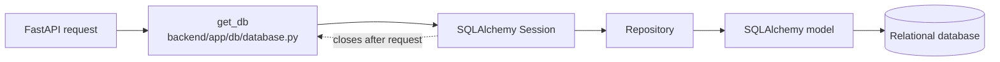
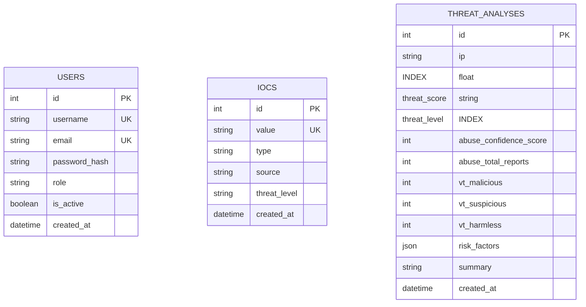
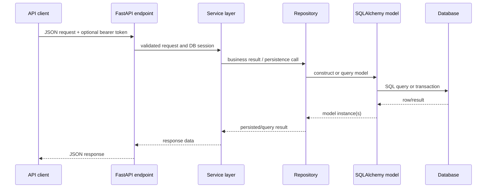

# ThreatLens AI - Database Documentation

This document describes the database implementation currently present in ThreatLens AI. It covers the SQLAlchemy models, Alembic migrations, repository behavior, and the local configuration needed to connect the backend to a database.

## 1. Database Overview

The backend uses:

- **SQLAlchemy 2.0** as the ORM and database abstraction layer.
- **Psycopg 3** and `psycopg-binary` as the PostgreSQL drivers listed in `backend/requirements.txt`.
- **Alembic** for schema migrations.
- A relational database selected by the `DATABASE_URL` setting. The repository's dependency and URL conventions are PostgreSQL-oriented, but the application does not hard-code a database name or host.

The database connection is created in `backend/app/db/database.py`:

1. `settings.DATABASE_URL` is passed to `sqlalchemy.create_engine`.
2. A `SessionLocal` factory is bound to that engine.
3. `get_db()` creates one session for a FastAPI request and closes it in a `finally` block.
4. Endpoint functions receive that session with `Depends(get_db)`.
5. Repositories use the session for queries and transaction operations.



The engine is configured with `echo=True`, so SQLAlchemy emits SQL statements to the backend logs. The application does not call `Base.metadata.create_all`; schema creation is handled by Alembic.

## 2. Database Configuration

### Configuration files

- `backend/app/core/config.py` defines the `Settings` class and loads values from `.env` using `pydantic-settings`.
- `backend/app/db/database.py` consumes `settings.DATABASE_URL` to create the SQLAlchemy engine and sessions.
- `backend/alembic/env.py` imports the same settings and replaces Alembic's blank `sqlalchemy.url` value with `settings.DATABASE_URL`.
- `backend/alembic.ini` points to `backend/alembic` through `script_location`; its `sqlalchemy.url` entry is intentionally blank because `env.py` supplies the runtime URL.
- `backend/.env` is a local ignored file. It must not be committed or copied into documentation.

### Required database setting

`DATABASE_URL` is required by `backend/app/core/config.py` and must point to a reachable database. The repository's Psycopg setup uses this shape:

```text
postgresql+psycopg://<database_user>:<database_password>@<database_host>:5432/<database_name>
```

Do not use the placeholder values literally, and do not put real passwords in source control.

The provider API keys and JWT settings are also required for backend settings initialization, but they are not database connection values. They are documented in `docs/03-setup-guide.md`; this document intentionally does not reproduce secrets or secret values.

## 3. Database Models

All models inherit from `Base` in `backend/app/db/database.py`. They are imported by `backend/app/models/__init__.py`, which is important because `backend/alembic/env.py` uses `Base.metadata` for migration autogeneration.

### User

- **Model:** `User`
- **Source:** `backend/app/models/user.py`
- **Table:** `users`
- **Purpose:** Stores local accounts used by registration, login, and JWT-backed current-user checks.

| Column | SQLAlchemy type | Nullable | Key/default/constraint |
| --- | --- | --- | --- |
| `id` | `Integer` | No | Primary key; `index=True` in the model. |
| `username` | `String(50)` | No | Unique and indexed. |
| `email` | `String(255)` | No | Unique and indexed. |
| `password_hash` | `String(255)` | No | Stores the bcrypt hash generated by `AuthService`; the plain password is not stored. |
| `role` | `String(50)` | No | Python default: `"analyst"`. |
| `is_active` | `Boolean` | No | Python default: `True`. |
| `created_at` | `DateTime(timezone=True)` | No | Server default: `func.now()`; explicitly non-nullable in the model. |

The migration also creates unique indexes for `username` and `email`, plus a non-unique index for `id`. `User` has no foreign keys and no SQLAlchemy relationships.

### IOC

- **Model:** `IOC`
- **Source:** `backend/app/models/ioc.py`
- **Table:** `iocs`
- **Purpose:** Stores analyst-managed indicators with their type, source, and current threat-level label.

| Column | SQLAlchemy type | Nullable | Key/default/constraint |
| --- | --- | --- | --- |
| `id` | `Integer` | No | Primary key; `index=True` in the model and migration. |
| `value` | `String` | No | Unique constraint; no model index. |
| `type` | `String` | No | No database enum or check constraint. |
| `source` | `String` | No | No database constraint beyond non-null. |
| `threat_level` | `String` | No | No database enum or check constraint. |
| `created_at` | `DateTime(timezone=True)` | Yes in migration | Server default: `func.now()` in the model; the migration leaves the column nullable. |

The application service validates `IP` and `DOMAIN` values before creation or update, but the database itself does not enforce those formats. The repository also checks uniqueness before insert/update and translates uniqueness conflicts to `409 Conflict` at the API layer.

`IOC` has no foreign keys and no SQLAlchemy relationships.

### ThreatAnalysis

- **Model:** `ThreatAnalysis`
- **Source:** `backend/app/models/threat_analysis.py`
- **Table:** `threat_analyses`
- **Purpose:** Stores the result of a completed rule-based correlation for an IP address.

| Column | SQLAlchemy type | Nullable | Key/default/constraint |
| --- | --- | --- | --- |
| `id` | `Integer` | No | Primary key; indexed in the model and migration. |
| `ip` | `String` | No | Indexed; no foreign key to `iocs`. |
| `threat_score` | `Float` | No | Correlated score. |
| `threat_level` | `String` | No | Indexed; no database enum/check constraint. |
| `abuse_confidence_score` | `Integer` | No | Python default: `0`. |
| `abuse_total_reports` | `Integer` | No | Python default: `0`. |
| `vt_malicious` | `Integer` | No | Python default: `0`. |
| `vt_suspicious` | `Integer` | No | Python default: `0`. |
| `vt_harmless` | `Integer` | No | Python default: `0`. |
| `risk_factors` | `JSON` | No | Python default: `list`; stores a list of strings. |
| `summary` | `String` | No | Generated analysis summary. |
| `created_at` | `DateTime(timezone=True)` | Yes in migration | Server default: `func.now()` in the model; the migration leaves the column nullable. |

The migration creates non-unique indexes for `id`, `ip`, and `threat_level`. It does not create foreign keys or relationships.

### Model versus migration defaults

The ORM model declarations and migration DDL are not identical in every detail:

- `User` migration defaults are represented as `nullable=False` columns but does not explicitly emit the model's Python defaults for `role` and `is_active`; the application supplies those values when it creates a user.
- `ThreatAnalysis` uses Python-side defaults for provider counts and `risk_factors`, while the migration defines those columns as non-nullable without explicit SQL server defaults.
- `IOC.created_at` and `ThreatAnalysis.created_at` use a server default in the model and migration but remain nullable in the migration.

When changing a model, update the model and generate/review a migration so the database schema and runtime assumptions remain aligned.

## 4. Entity Relationships

There are currently no declared entity relationships. No table contains a foreign-key column, and no model defines `relationship()`.



The diagram intentionally shows three independent entities. An analysis IP may have the same text as an IOC value, but that is an application-level coincidence, not a database relationship.

## 5. IOC Data Model

An IOC is represented by the `IOC` model and persisted in `iocs`. Its required fields are `value`, `type`, `source`, and `threat_level`; `id` and `created_at` are generated by the database/ORM.

The processing path is:

1. `backend/app/api/endpoints/ioc.py` receives an authenticated request.
2. `backend/app/services/ioc_service.py` validates `IP` values with `IOCValidator.validate_ip` and `DOMAIN` values with `IOCValidator.validate_domain`.
3. `backend/app/repositories/ioc_repository.py` checks for duplicate `value`, writes the model, commits, and refreshes it.
4. List queries support exact filters for `type`, `source`, and `threat_level`, substring search on `value`, pagination, and an allowlist of sort columns.

The database has one uniqueness constraint on `iocs.value`. It has no type enum, threat-level enum, source catalog, user ownership, analysis ownership, or foreign keys.

## 6. Threat Analysis Data Model

Threat analysis persistence is implemented. `backend/app/services/threat_correlation_service.py` sends provider-derived fields to `ThreatAnalysisRepository.create`, which inserts one `ThreatAnalysis` row and commits the transaction.

The row contains:

- The analyzed `ip`.
- The final `threat_score` and derived `threat_level`.
- AbuseIPDB confidence and report counts.
- VirusTotal malicious, suspicious, and harmless counts.
- A JSON `risk_factors` list.
- A generated text `summary`.
- The creation timestamp.

`backend/app/repositories/threat_analysis_repository.py` reads rows ordered by `created_at DESC`, either across all IPs with `limit`/`offset` or for one exact IP. Analyses are append-only through the current API: there is no update or delete analysis repository method.

The database does not store the raw AbuseIPDB/VirusTotal payloads, provider request IDs, the initiating user ID, or a foreign-key link to an IOC.

## 7. User and Authentication Data

`backend/app/models/user.py` stores account identity and authentication-related state. `backend/app/services/auth_service.py` creates users through `UserRepository.create`, passing a bcrypt password hash produced by `backend/app/core/security.py`.

At login, `AuthService.login` looks up a user by username, rejects inactive accounts, verifies the submitted password against `password_hash`, and creates a JWT. The token contains the user's ID, username, role, and expiration, but the token itself is not stored in the database.

`backend/app/api/dependencies.py` decodes the bearer token, reads the `sub` user ID, loads that row with `UserRepository.get_by_id`, and checks `is_active`. The `role` column is currently informational: there are no role-specific database queries or authorization policies.

Password hashes, JWT signing secrets, and credentials are deliberately not shown in this document.

## 8. Migrations

### Configuration and locations

- Migration configuration: `backend/alembic.ini`.
- Migration environment: `backend/alembic/env.py`.
- Migration template: `backend/alembic/script.py.mako`.
- Migration directory: `backend/alembic/versions/`.
- Model metadata: `Base.metadata` from `backend/app/db/database.py`, with models imported through `backend/app/models/__init__.py`.

### Existing migration chain

The current linear chain is:

```text
71eef07d67a8  create_iocs_table
		|
59e8f28a5c03  create_threat_analyses_table
		|
ea7c6b34fd11  add_users_table  (current head)
```

Files:

- `backend/alembic/versions/71eef07d67a8_create_iocs_table.py` creates `iocs`, its primary key, unique value constraint, and ID index.
- `backend/alembic/versions/59e8f28a5c03_create_threat_analyses_table.py` creates `threat_analyses` and indexes for ID, IP, and threat level.
- `backend/alembic/versions/ea7c6b34fd11_add_users_table.py` creates `users` and unique indexes for username/email plus an ID index.

### Apply migrations

Run from `backend/` with the virtual environment active and a configured `.env`:

```bash
alembic upgrade head
```

### Check migration status

```bash
alembic current
alembic heads
```

`alembic current` reports the revision applied to the configured database; `alembic heads` reports the repository's current migration head.

### Create a migration

After changing a SQLAlchemy model, run from `backend/`:

```bash
alembic revision --autogenerate -m "describe schema change"
```

Review the generated file under `backend/alembic/versions/` before applying it. The repository's `env.py` imports all current models and supplies `Base.metadata`, which enables autogeneration to compare model metadata with the database.

### Roll back a migration

The existing migration files define `downgrade()` functions. Alembic therefore supports stepping back one revision:

```bash
alembic downgrade -1
```

To downgrade all the way to the base revision in a disposable local database:

```bash
alembic downgrade base
```

Do not run destructive downgrades against shared or production data without an approved backup and migration plan.

## 9. Local Database Setup

The repository does not create or run a database server. The root `docker-compose.yml` and `docker/` directory are currently empty, so there is no repository-provided database container.

For a local setup:

1. Install/start a PostgreSQL-compatible database using the developer's approved local method.
2. Create a local database and database user outside the repository.
3. Put the connection URL in `backend/.env` as `DATABASE_URL`, without committing credentials.
4. From `backend/`, activate the virtual environment and apply the migration chain:

```bash
source .venv/bin/activate
alembic upgrade head
```

5. Start the backend and exercise `GET /api/v1/health` to confirm the process is running. That endpoint is static and does not prove database connectivity; registration or a protected endpoint performs a database-backed operation.

The backend creates sessions lazily per request. It does not perform a startup database health check or create tables automatically.

## 10. Common Database Operations

### Add a model

1. Add a SQLAlchemy model module under `backend/app/models/` inheriting from `Base`.
2. Import it in `backend/app/models/__init__.py` so Alembic sees it.
3. Add a repository under `backend/app/repositories/` if application queries or transactions are needed.
4. Add an Alembic revision and review its generated DDL.

### Modify a model

Update the relevant model in `backend/app/models/`, then generate and review a migration:

```bash
cd backend
alembic revision --autogenerate -m "describe model change"
```

Model changes alone do not alter an existing database. Apply the reviewed migration with `alembic upgrade head`.

### Add and apply a migration

```bash
cd backend
alembic revision --autogenerate -m "describe schema change"
alembic upgrade head
```

For a migration that cannot be safely inferred, create a blank revision with Alembic and write the `upgrade()` and `downgrade()` operations explicitly:

```bash
alembic revision -m "describe manual schema change"
```

### Roll back

Supported commands are:

```bash
alembic downgrade -1
alembic downgrade base
```

Review the target revision and the migration's `downgrade()` implementation first.

### Reset the local database

There is no project reset script or database reset command in the repository. For a disposable local database, use the database administrator tooling appropriate to the local PostgreSQL installation to drop/recreate the database, then run:

```bash
cd backend
alembic upgrade head
```

Do not use a destructive reset against shared data. The application does not provide a reset endpoint.

## 11. Database Flow

The normal persisted request path is:



For IOC creation, the service first validates the value and the repository commits a new `IOC`. For correlation, the service first calls external providers, calculates the result, and then the repository commits a new `ThreatAnalysis`. Authentication uses the same session pattern to read `User` rows.

## 12. Database Limitations

The current database implementation has these known boundaries:

- The repository does not provide a database server, Docker database configuration, or automatic database creation.
- The root `docker-compose.yml` is empty.
- The database URL is required at import/configuration time; there is no fallback database configuration in source.
- There are no foreign keys or ORM relationships between `users`, `iocs`, and `threat_analyses`.
- Threat analyses are not associated with the user who ran them or with an IOC record.
- No database-level enum/check constraints enforce IOC types or threat-level values; some validation exists only in application services.
- No database-level default is emitted by the checked-in migrations for the model's Python defaults on user and threat-analysis fields.
- `IOC.created_at` and `ThreatAnalysis.created_at` are nullable in their migrations even though the model declarations provide server defaults.
- There are no database seed files or reset scripts.
- There are no backend tests under `backend/app/tests/` for database behavior.
- There is no startup connectivity check or automatic migration execution.

These are current implementation limitations, not planned database features. Any future schema change should update both the SQLAlchemy model and an Alembic migration, and should add the relationships or constraints explicitly if they become part of the design.
