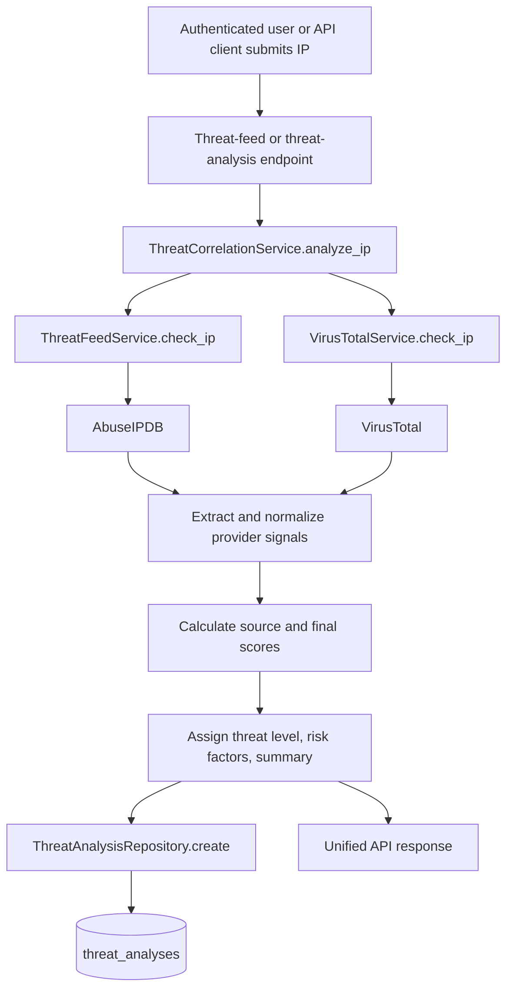

# ThreatLens AI - Threat Intelligence Guide

This guide explains how threat intelligence is currently collected, processed, scored, and stored in ThreatLens AI. The implementation is an IP-focused, rule-based workflow backed by two external providers.

## 1. Threat Intelligence Overview

Within ThreatLens AI, threat intelligence means reputation and detection signals retrieved for an IP address from external services:

- AbuseIPDB supplies an abuse confidence score and report count.
- VirusTotal supplies multi-engine counts and additional IP metadata.
- `ThreatCorrelationService` combines the available signals into a 0-100 threat score, a severity label, risk factors, and a text summary.

The current implementation supports IP investigation only in its provider and correlation workflows. The IOC database can store IP and domain records, but there is no provider lookup or correlation workflow for domains, hashes, URLs, or other indicator types.

The application name includes “AI”, but the current threat assessment does not call a machine-learning model or an LLM. The scoring, risk-factor selection, and summaries are implemented as deterministic Python rules in `backend/app/services/threat_correlation_service.py`.

## 2. Supported Threat Intelligence Providers

### AbuseIPDB

- **Purpose:** IP reputation and abuse-report lookup.
- **Integration:** `backend/app/services/threat_feed_service.py`, `ThreatFeedService.check_ip`.
- **API used:** `GET https://api.abuseipdb.com/api/v2/check`.
- **Configuration:** `ABUSEIPDB_API_KEY` from `backend/app/core/config.py`.
- **Request:** Sends the requested IP as the `ipAddress` query parameter and sends `maxAgeInDays=90`. The API key is sent in the `Key` header and the request asks for JSON with `Accept: application/json`.
- **Data used by ThreatLens AI:** From the provider response, correlation reads `data.abuseConfidenceScore` and `data.totalReports`. The direct lookup route returns the provider's complete JSON response.
- **Errors:** A timeout becomes `504` with `AbuseIPDB request timed out.`; an HTTP error preserves the provider status and uses `AbuseIPDB API request failed.`; a connection/request error becomes `503` with `Unable to connect to AbuseIPDB.`.
- **Status:** Implemented and used by both direct lookup and correlation flows.

### VirusTotal

- **Purpose:** Multi-engine IP analysis and IP metadata lookup.
- **Active integration:** `backend/app/services/virus_total_service.py`, `VirusTotalService.check_ip`.
- **API used:** `GET https://www.virustotal.com/api/v3/ip_addresses/{ip}`.
- **Configuration:** `VIRUSTOTAL_API_KEY` from `backend/app/core/config.py`.
- **Request:** Sends the API key in the `x-apikey` header and requests JSON with `Accept: application/json`.
- **Normalized data returned:** `ip`, `country`, `asn`, `network`, `reputation`, `malicious`, `suspicious`, `harmless`, and `undetected`. Correlation uses the three engine counts `malicious`, `suspicious`, and `harmless`.
- **Errors:** A timeout becomes `504` with `VirusTotal request timed out.`; an HTTP error preserves the provider status and uses `VirusTotal API request failed.`; a connection/request error becomes `503` with `Unable to connect to VirusTotal.`; missing or incorrectly shaped `data.attributes` content becomes `502` with `Unexpected response received from VirusTotal.`.
- **Status:** Implemented and used by both direct lookup and correlation flows.

There is also a second VirusTotal implementation, `ThreatFeedService.check_virustotal` in `backend/app/services/threat_feed_service.py`. The active route imports and calls `VirusTotalService.check_ip`; the duplicate method is not used by the current router.

No other external threat-intelligence provider is implemented. No additional provider is currently available as a planned module or configuration entry in the repository.

## 3. Threat Intelligence Request Flow

The main flow for a saved assessment is:



Direct provider requests stop after provider response/normalization and return data to the client. They do not call `ThreatAnalysisRepository`.

## 4. IP Investigation

### Input and validation

An IP is supplied as a path parameter. `backend/app/validators/ip_validator.py` uses Python's `ipaddress.ip_address` and accepts valid IPv4 and IPv6 values.

There are two analysis routes:

- `GET /api/v1/threat-feed/analyze/{ip}` explicitly validates the path value in `backend/app/api/endpoints/threat_feed.py` and returns `400` with `Invalid IP address` when validation fails.
- `POST /api/v1/threat-analysis/{ip}/analyze` calls the correlation service directly from `backend/app/api/endpoints/threat_analysis.py` and does not perform that explicit endpoint-level validation. It still passes the supplied string to the providers.

Both routes require the shared authenticated-user dependency. Direct provider routes also require authentication, but they do not perform the explicit IP validation before calling their provider service.

### Provider calls and collected data

`ThreatCorrelationService.analyze_ip` calls both providers independently:

1. `ThreatFeedService.check_ip(ip)` retrieves raw AbuseIPDB JSON.
2. `VirusTotalService.check_ip(ip)` retrieves and normalizes VirusTotal JSON.
3. Each provider failure is caught and recorded separately as `abuse_error` or `virustotal_error`.

The correlation service extracts:

- AbuseIPDB: confidence score and total reports.
- VirusTotal: malicious, suspicious, and harmless engine counts.

The direct VirusTotal endpoint additionally exposes country, ASN, network, reputation, and undetected counts. Those additional fields are not stored in `ThreatAnalysis`.

### Processing and output

The service clamps AbuseIPDB confidence to 0-100, prevents negative report/count values, calculates the correlated score, determines the level, builds text risk factors, and generates a summary. It stores the result through `ThreatAnalysisRepository.create` and returns a nested payload containing:

- `ip`
- `threat_score`
- `threat_level`
- `abuseipdb.confidence_score` and `abuseipdb.total_reports`
- `virustotal.malicious`, `virustotal.suspicious`, and `virustotal.harmless`
- `analysis.risk_factors` and `analysis.summary`

The saved row contains flattened fields and a timestamp. Direct feed lookups are not persisted.

## 5. Threat Assessment and Scoring

All scoring and classification is implemented in `backend/app/services/threat_correlation_service.py`, in `ThreatCorrelationService.analyze_ip`.

### AbuseIPDB score

The service uses two signals:

```text
report_component = min(total_reports, 100)
abuse_score = (abuse_confidence * 0.85) + (report_component * 0.15)
```

The result is rounded to two decimal places and clamped to 0-100. The report count is capped at 100; it is not otherwise scaled.

### VirusTotal score

The service assigns:

```text
malicious_score = malicious_engines * 10
suspicious_score = suspicious_engines * 5
virus_total_score = min(malicious_score + suspicious_score, 100)
```

The result is rounded to two decimal places. Harmless and undetected counts are returned/stored as context but do not add points or subtract points.

### Final score

When both provider responses are available:

```text
threat_score = (abuse_score * 0.60) + (virus_total_score * 0.40)
```

When only one provider succeeds, its score is used as the final score. If neither succeeds, the service raises `503` rather than producing a zero-score analysis.

The final score is rounded to two decimal places and clamped to 0-100.

### Threat levels

| Score | Level |
| --- | --- |
| `< 30` | `LOW` |
| `30` through `< 60` | `MEDIUM` |
| `60` through `< 80` | `HIGH` |
| `>= 80` | `CRITICAL` |

### Risk factors and summary

Risk factors are plain strings generated by the correlation service. They can include:

- Moderate, elevated, or high AbuseIPDB confidence findings.
- Multiple or high numbers of AbuseIPDB reports.
- VirusTotal malicious-engine detections.
- VirusTotal suspicious-engine detections.
- Provider-unavailable messages and provider-specific error details.

The summary is selected from fixed text based on the final threat level. There is no probabilistic model, learned classifier, LLM-generated explanation, or confidence interval.

## 6. Threat Feed Processing

Threat-feed routes are defined in `backend/app/api/endpoints/threat_feed.py` under `/api/v1/threat-feed`:

| Route | Processing | Persisted? |
| --- | --- | --- |
| `GET /check/{ip}` | Calls `ThreatFeedService.check_ip` and returns raw AbuseIPDB JSON. | No |
| `GET /virustotal/{ip}` | Calls `VirusTotalService.check_ip` and returns normalized VirusTotal fields. | No |
| `GET /analyze/{ip}` | Validates the IP, calls correlation, saves the analysis, and returns `ThreatAnalysisResponse`. | Yes, in `threat_analyses` |

All three routes use `get_current_user`. The provider services create an `httpx.AsyncClient(timeout=10.0)` for each call, perform an HTTP GET, call `raise_for_status()`, and return either provider data or an `HTTPException`.

The direct AbuseIPDB response is not converted to a Pydantic response schema, so its exact fields are provider-defined. The direct VirusTotal response is an application-defined dictionary assembled by `VirusTotalService`.

## 7. Correlation

Correlation is implemented, rule-based, and synchronous from the API client's perspective even though the provider calls are asynchronous. Its single entry point is:

```python
ThreatCorrelationService.analyze_ip(ip=ip, db=db)
```

It is called by:

- `analyze_ip` in `backend/app/api/endpoints/threat_feed.py` for `GET /api/v1/threat-feed/analyze/{ip}`.
- `analyze_ip` in `backend/app/api/endpoints/threat_analysis.py` for `POST /api/v1/threat-analysis/{ip}/analyze`.

The inputs are an IP string and a SQLAlchemy session. The service independently attempts AbuseIPDB and VirusTotal, retains successful results and error details, extracts the scoring signals, applies the source weights, derives the level, constructs risk factors and summary, persists the analysis, and returns the unified nested result.

Persistence is performed by `ThreatAnalysisRepository.create` in `backend/app/repositories/threat_analysis_repository.py`, which inserts into the `threat_analyses` table and commits. The current API has no update or delete operation for analyses. History is read by `get_all` or `get_by_ip` in the same repository.

No planned or unimplemented “AI correlation engine” is described as active here. Any future machine-learning, LLM, multi-indicator, or cross-entity correlation would be new functionality rather than a current part of this service.

## 8. External API Configuration

The provider settings are declared in `backend/app/core/config.py` and loaded from the backend `.env` file:

```dotenv
ABUSEIPDB_API_KEY=<your-abuseipdb-key>
VIRUSTOTAL_API_KEY=<your-virustotal-key>
```

Both settings are required for the Pydantic `Settings` object to initialize, even if a particular request does not call both providers. Never commit real keys or include them in logs, examples, or screenshots.

The same settings module also requires the application, database, and JWT configuration needed to start the backend. Those values are not provider integrations and are documented in `docs/03-setup-guide.md`.

## 9. Failure Handling

### Provider unavailable or unreachable

The provider service converts `httpx.RequestError` into `503` with a provider-specific connection message. During correlation, that exception is caught and saved as an error string rather than immediately aborting the whole analysis.

### Provider returns an HTTP error

`response.raise_for_status()` raises `httpx.HTTPStatusError`. Direct routes return the provider's HTTP status with a generic provider failure detail. During correlation, the error is recorded as a risk factor if the other provider succeeds.

### Provider times out

Both active adapters use a 10-second HTTPX timeout. Direct requests return `504` with the matching timeout detail. During correlation, the timeout is recorded for that provider; the other provider may still produce a result.

### Invalid IP

`GET /api/v1/threat-feed/analyze/{ip}` uses `validate_ip` and returns `400` for an invalid IPv4/IPv6 value. The direct feed routes and `POST /api/v1/threat-analysis/{ip}/analyze` do not perform this explicit endpoint validation.

### One provider succeeds and one fails

Correlation proceeds with the successful provider. It uses that provider's score, adds an unavailable-provider risk factor, and persists/returns the analysis. It raises `503` only when both provider results are `None`.

### Required credentials are missing

`ABUSEIPDB_API_KEY` and `VIRUSTOTAL_API_KEY` are required fields in `Settings`. If required settings are absent, Pydantic settings initialization fails while importing the backend configuration; there is no fallback or anonymous provider mode. A configured but invalid provider key instead produces the provider's HTTP error path.

## 10. Threat Intelligence Data Flow

```mermaid
flowchart LR
	Input[IP input]
	Validate[IP validation\nfeed analysis route only]
	AbuseReq[ThreatFeedService.check_ip]
	VTReq[VirusTotalService.check_ip]
	Abuse[AbuseIPDB result]
	VT[VirusTotal normalized result]
	Signals[Extract confidence, reports,\nmalicious/suspicious/harmless counts]
	Analysis[ThreatCorrelationService.analyze_ip]
	Score[Source scores and final score]
	Risk[Threat level, risk factors, summary]
	Store[ThreatAnalysisRepository.create]
	DB[(threat_analyses)]
	Response[Unified API response]

	Input --> Validate
	Validate --> AbuseReq
	Validate --> VTReq
	AbuseReq --> Abuse --> Signals
	VTReq --> VT --> Signals
	Signals --> Analysis --> Score --> Risk
	Risk --> Store --> DB
	Risk --> Response
```



The direct lookup routes use only the provider request and response portions of this diagram. IOC records can be analyzed from the frontend, but the backend correlation operation still receives and processes the IOC's IP value as an independent IP request; there is no database relationship between an IOC row and an analysis row.

## 11. Developer Guide: Adding a Provider

Follow the current service/router/schema layering:

1. **Create the adapter:** Add a provider service module under `backend/app/services/`, following the asynchronous `httpx.AsyncClient` pattern used by `threat_feed_service.py` and `virus_total_service.py`.
2. **Add configuration:** Add a required or optional settings field in `backend/app/core/config.py` and document its placeholder in the setup documentation. Do not hard-code the credential.
3. **Normalize the response:** Return a small application dictionary containing only the provider fields needed by the API or correlation logic. Handle timeout, HTTP, connection, and malformed-response errors consistently with the existing adapters.
4. **Connect correlation:** Update `backend/app/services/threat_correlation_service.py` if the new provider should participate in scoring. Define how missing data behaves, how its signals are weighted, and how errors appear in `risk_factors`.
5. **Update persistence if needed:** If new provider values must be retained, update `backend/app/models/threat_analysis.py`, `backend/app/repositories/threat_analysis_repository.py`, and add an Alembic migration under `backend/alembic/versions/`.
6. **Update schemas if needed:** Modify `backend/app/schemas/threat_analysis.py` when the public unified response needs a new nested provider section. Direct provider endpoints may use a provider-specific response shape, as the current direct AbuseIPDB route does.
7. **Add a route if needed:** Add a route function to `backend/app/api/endpoints/threat_feed.py` or create a new endpoint module and include its router in `backend/app/api/router.py`. Protect it with `current_user=Depends(get_current_user)` if it is an authenticated feature.
8. **Test the failure modes:** The repository currently has no backend tests under `backend/app/tests/`. At minimum, manually verify valid responses, provider HTTP failures, timeouts, malformed responses, missing credentials, and the one-provider-success case. Automated tests should mock HTTPX/provider boundaries rather than call live provider APIs.

Do not describe a new provider as active until its adapter is wired into a route or the correlation service and its configuration is available.

## 12. Current Limitations

- Only AbuseIPDB and VirusTotal are integrated.
- The workflow is IP-only; domain IOC storage does not provide domain threat-feed lookup or correlation.
- Direct feed results are not persisted.
- Correlation stores selected numeric fields and generated text, not raw provider payloads or provider metadata such as country, network, reputation, or undetected counts.
- Analyses are not linked to the initiating user or an IOC through foreign keys.
- The two analysis routes have different validation behavior: the feed `GET` route validates IP syntax, while the threat-analysis `POST` route does not explicitly do so.
- Direct feed routes also do not explicitly validate IP syntax before making provider requests.
- Provider API calls depend on external network availability, provider rate limits, valid credentials, and a 10-second timeout.
- If both providers fail, no analysis row is created and the service returns `503`.
- The API requires both provider settings at application configuration initialization; there is no optional-provider startup mode.
- The scoring system is fixed rule-based logic. There is no ML, LLM, AI inference, scheduled ingestion, background worker, alert delivery, or general-purpose correlation engine implemented.
- The duplicate `ThreatFeedService.check_virustotal` method is not the active VirusTotal route implementation.
- No backend test suite currently exists under `backend/app/tests/`.
