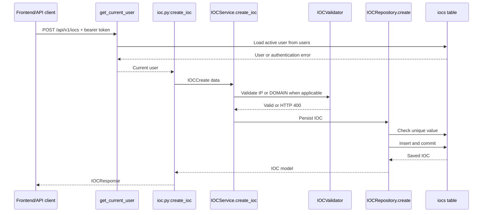

# ThreatLens AI - IOC Management Guide

This guide describes the IOC (Indicator of Compromise) functionality currently implemented in ThreatLens AI. The backend stores IOC records independently from the threat-analysis records, and the frontend exposes the available CRUD and investigation actions from the IOC Intelligence page.

## 1. IOC Overview

An IOC is a value associated with potentially malicious activity. In ThreatLens AI, an IOC record contains a value, a type, a source, a threat-level label, and a creation timestamp.

### Current type behavior

The code has two different levels of type support:

- `IP` is explicitly supported by `IOCValidator.validate_ip`, which accepts valid IPv4 and IPv6 addresses.
- `DOMAIN` is explicitly supported by `IOCValidator.validate_domain`, which applies the current domain regular expression.
- The Pydantic `IOCCreate` schema accepts `type` as an unrestricted string. The service only validates values when the type uppercases to `IP` or `DOMAIN`; other type strings are stored without type-specific validation.
- The frontend offers `IP`, `DOMAIN`, `URL`, and `HASH` choices in its forms. `URL` and `HASH` are therefore UI choices and storable labels, but there is no backend URL or hash validator or provider investigation flow for them.

### Implemented operations

Authenticated API clients can:

- Create an IOC.
- List IOCs with filtering, search, pagination, and sorting.
- Retrieve one IOC by ID.
- Replace an IOC with updated values.
- Delete an IOC.

The frontend page at `frontend/src/app/iocs/page.tsx` provides corresponding list, add, edit, detail, delete, refresh, and IP-analysis interactions.

Creating an IOC does not automatically call AbuseIPDB, VirusTotal, threat analysis, correlation, or scoring. Analysis is a separate user action and currently applies only to an IOC whose type is `IP`.

## 2. IOC Data Model

- **Model:** `IOC`
- **Source:** `backend/app/models/ioc.py`
- **Table:** `iocs`
- **Purpose:** Persist a unique indicator value and its analyst-supplied metadata.

| Field | SQLAlchemy type | Nullable | Key/constraint/default |
| --- | --- | --- | --- |
| `id` | `Integer` | No | Primary key; `index=True`. |
| `value` | `String` | No | Unique at the model and migration level. |
| `type` | `String` | No | No database enum or check constraint. |
| `source` | `String` | No | No additional database constraint. |
| `threat_level` | `String` | No | No database enum or check constraint. |
| `created_at` | `DateTime(timezone=True)` | Nullable in migration | Server default `func.now()` in the ORM model. |

The initial migration is `backend/alembic/versions/71eef07d67a8_create_iocs_table.py`. It creates the table, primary key, unique `value` constraint, and a non-unique index on `id`. There are no foreign keys and no SQLAlchemy relationships from `IOC` to `User` or `ThreatAnalysis`.

The database migration defines `created_at` as nullable with a database `now()` server default. The ORM model does not declare `nullable=False` for this field, matching the migration's nullable setting.

## 3. IOC API Endpoints

The router is defined in `backend/app/api/endpoints/ioc.py` with the `/iocs` prefix and is mounted under `/api/v1` by `backend/app/api/router.py`. Every IOC route declares `current_user=Depends(get_current_user)` and therefore requires a valid active-user bearer token.

### Common request and response schemas

`backend/app/schemas/ioc.py` defines:

```json
{
	"value": "203.0.113.10",
	"type": "IP",
	"source": "Manual",
	"threat_level": "HIGH"
}
```

This is the `IOCCreate` shape used for both create and update endpoints. `IOCUpdate` has the same fields but is not used by the route implementation. Successful create, list, get, and update responses use `IOCResponse`:

```json
{
	"id": 7,
	"value": "203.0.113.10",
	"type": "IP",
	"source": "Manual",
	"threat_level": "HIGH",
	"created_at": "2026-08-21T10:15:00"
}
```

### Create an IOC

**`POST /api/v1/iocs`**

Creates and persists one IOC.

- **Authentication:** Required; active JWT bearer token.
- **Body:** `IOCCreate` with required string fields `value`, `type`, `source`, and `threat_level`.
- **Processing:** `create_ioc` -> `IOCService.create_ioc` -> type-specific validator when applicable -> `IOCRepository.create`.
- **Success:** `200 OK` with one `IOCResponse` object.

Example:

```bash
curl -X POST http://127.0.0.1:8000/api/v1/iocs \
	-H 'Authorization: Bearer <jwt_access_token>' \
	-H 'Content-Type: application/json' \
	-d '{"value":"203.0.113.10","type":"IP","source":"Manual","threat_level":"HIGH"}'
```

Possible errors:

- `400 Bad Request`, `Invalid IP address.` or `Invalid domain.` when a declared `IP` or `DOMAIN` value fails its validator.
- `401 Unauthorized` or `403 Forbidden` for missing/invalid authentication or an inactive account.
- `409 Conflict` when the value already exists.
- `422 Unprocessable Entity` when a required body field is missing or is not a string.

Source: `create_ioc` in `backend/app/api/endpoints/ioc.py`; service: `IOCService.create_ioc` in `backend/app/services/ioc_service.py`.

### List IOCs

**`GET /api/v1/iocs`**

Returns a plain JSON array of IOC response objects.

- **Authentication:** Required; active JWT bearer token.
- **Handler:** `get_all_iocs` in `backend/app/api/endpoints/ioc.py`.

Query parameters:

| Parameter | Type | Default | Behavior |
| --- | --- | --- | --- |
| `type` | string or null | omitted | Exact match against `IOC.type`. |
| `source` | string or null | omitted | Exact match against `IOC.source`. |
| `threat_level` | string or null | omitted | Exact match against `IOC.threat_level`. |
| `search` | string or null | omitted | Substring search within `IOC.value`. |
| `limit` | integer | `10` | Passed to SQLAlchemy `limit`. |
| `offset` | integer | `0` | Passed to SQLAlchemy `offset`. |
| `sort_by` | string | `created_at` | Allowed: `id`, `value`, `type`, `source`, `threat_level`, `created_at`; unknown names fall back to `created_at`. |
| `sort_order` | string | `desc` | `desc` uses descending order; any other value uses ascending order. |

Example:

```bash
curl 'http://127.0.0.1:8000/api/v1/iocs?type=IP&threat_level=HIGH&search=203&limit=10&offset=0&sort_by=created_at&sort_order=desc' \
	-H 'Authorization: Bearer <jwt_access_token>'
```

Example response:

```json
[
	{
		"id": 7,
		"value": "203.0.113.10",
		"type": "IP",
		"source": "Manual",
		"threat_level": "HIGH",
		"created_at": "2026-08-21T10:15:00"
	}
]
```

Possible errors are `401`/`403` for authentication, `422` for query parameters that cannot be parsed as their declared types, and database/server errors if the session cannot query the database.

Source: `get_all_iocs`; service delegation: `IOCService.get_all_iocs`; query implementation: `IOCRepository.get_all`.

### Get an IOC by ID

**`GET /api/v1/iocs/{ioc_id}`**

Returns one IOC identified by an integer ID.

Example:

```bash
curl http://127.0.0.1:8000/api/v1/iocs/7 \
	-H 'Authorization: Bearer <jwt_access_token>'
```

Success is `200 OK` with an `IOCResponse` object. If no record exists, the service raises `404 Not Found`:

```json
{
	"detail": "IOC not found"
}
```

Other errors: `401`/`403` for authentication and `422` for a non-integer `ioc_id`.

Source: `get_ioc_by_id` in `backend/app/api/endpoints/ioc.py`; service: `IOCService.get_ioc_by_id`.

### Update an IOC

**`PUT /api/v1/iocs/{ioc_id}`**

Replaces the stored `value`, `type`, `source`, and `threat_level`. The `created_at` timestamp and ID are not changed by the repository update operation.

- **Authentication:** Required; active JWT bearer token.
- **Body:** `IOCCreate`, not `IOCUpdate`, despite the separate schema definition.
- **Validation:** The same IP/domain validation used by creation.
- **Duplicate handling:** The replacement value cannot match another IOC's value.

Example:

```bash
curl -X PUT http://127.0.0.1:8000/api/v1/iocs/7 \
	-H 'Authorization: Bearer <jwt_access_token>' \
	-H 'Content-Type: application/json' \
	-d '{"value":"203.0.113.11","type":"IP","source":"Manual review","threat_level":"MEDIUM"}'
```

Success is `200 OK` with the updated `IOCResponse` object. Possible errors are:

- `400 Bad Request` for invalid IP/domain values.
- `404 Not Found` with `IOC not found` when the ID does not exist.
- `409 Conflict` when another record already uses the replacement value.
- `401`/`403` for authentication.
- `422` for invalid path or body values.

Source: `update_ioc` in `backend/app/api/endpoints/ioc.py`; service: `IOCService.update_ioc`; persistence: `IOCRepository.update`.

### Delete an IOC

**`DELETE /api/v1/iocs/{ioc_id}`**

Deletes the record with the specified integer ID.

Example:

```bash
curl -X DELETE http://127.0.0.1:8000/api/v1/iocs/7 \
	-H 'Authorization: Bearer <jwt_access_token>'
```

Success is `200 OK`:

```json
{
	"message": "IOC deleted successfully"
}
```

If the record does not exist, the endpoint returns `404 Not Found` with `IOC not found`. It can also return `401`/`403` for authentication or `422` for a non-integer ID.

`IOCRepository.delete` loads the record, calls `db.delete(ioc)`, commits, and returns the deleted object. There is no authorization check against an IOC owner because IOC records have no owner field; any authenticated active user is treated alike.

Source: `delete_ioc` in `backend/app/api/endpoints/ioc.py`; persistence: `IOCRepository.delete`.

## 4. Creating an IOC

The backend creation path is:



The endpoint receives the resolved `current_user`, but the current service does not use it to assign ownership or alter the IOC record.

## 5. Reading and Listing IOCs

`IOCService.get_all_iocs` forwards all list arguments to `IOCRepository.get_all`. The repository starts with `db.query(IOC)` and conditionally adds:

- Exact filters for `type`, `source`, and `threat_level`.
- `IOC.value.contains(search)` for value search.
- An allowlisted sort column, defaulting to `created_at` if `sort_by` is unknown.
- Descending order only when `sort_order.lower() == "desc"`; all other values use ascending order.
- SQLAlchemy `offset` and `limit`.

The response is a plain array of `IOCResponse` objects. There is no total count, cursor, or pagination metadata object.

Every read route requires the active-user dependency. However, the backend does not filter records by the authenticated user, role, or tenant because the IOC model has no ownership fields and no role-based authorization policy.

## 6. Updating IOCs

IOC updates are supported through `PUT /api/v1/iocs/{ioc_id}`. The operation replaces all four client-supplied fields:

- `value`
- `type`
- `source`
- `threat_level`

It does not update `id` or `created_at`. IP and domain validation is repeated before the repository is called. The repository checks for a duplicate value belonging to another ID, updates the model, commits, refreshes it, and returns it.

There is no partial-update `PATCH` endpoint and no separate backend update service model in use; `IOCUpdate` exists in `backend/app/schemas/ioc.py` but is not referenced by the route.

## 7. Deleting IOCs

Deletion is implemented only through `DELETE /api/v1/iocs/{ioc_id}`. The route requires an active bearer-token user but does not perform owner or role checks. `IOCRepository.delete` removes the row and commits immediately. There is no soft-delete flag, deletion timestamp, audit record, or cascade behavior in the model.

The route returns a fixed success message and returns `404` when the repository cannot find the requested ID.

## 8. IOC Validation

### Request-level validation

`IOCCreate` requires all four fields and declares all of them as `str`:

```python
value: str
type: str
source: str
threat_level: str
```

There are no Pydantic min/max length, enum, trim, case-normalization, or non-empty constraints on these fields. Missing fields or non-string values that fail Pydantic parsing produce FastAPI's `422` validation response.

### Type-specific validation

`IOCService.create_ioc` and `IOCService.update_ioc` compare `data.type.upper()`:

- For `IP`, `IOCValidator.validate_ip` calls `ipaddress.ip_address` and accepts IPv4 or IPv6 values. Invalid values produce `400` with `Invalid IP address.`.
- For `DOMAIN`, `IOCValidator.validate_domain` applies the regular expression in `backend/app/validators/ioc_validator.py`. It requires one or more dot-separated labels, permits letters/digits/hyphens in non-final labels, rejects a leading hyphen, and requires a final alphabetic label between 2 and 63 characters. Invalid values produce `400` with `Invalid domain.`.
- Any other type is not rejected and receives no type-specific validation in the backend service.

The validation methods do not normalize or rewrite the value. The exact submitted strings are passed to repository persistence.

### Duplicate handling

`iocs.value` is unique. On create, `IOCRepository.create` first queries for an existing value and raises `409` if found. It also catches `IntegrityError`, rolls back, and raises the same conflict response for a concurrent uniqueness conflict. On update, it checks for the same value on a different IOC ID and raises `409`.

There is no case-insensitive uniqueness logic in the repository; comparisons use the database's normal string comparison behavior.

## 9. IOC and Threat Intelligence

Creating or updating an IOC does **not** automatically trigger:

- AbuseIPDB lookup.
- VirusTotal lookup.
- Threat correlation.
- Threat-score calculation.
- A change to the stored IOC's `threat_level`.

IOC CRUD is handled by `IOCService`; provider and correlation behavior is handled separately by the threat-feed and threat-analysis endpoints.

## 10. IOC and Threat Analysis

The connection is an application-level action, not a database relationship:

1. The frontend opens an IOC's details.
2. `frontend/src/app/iocs/page.tsx` allows analysis only when `selectedIOC.type.toUpperCase() === "IP"`.
3. It sends the selected IOC value to `POST /api/v1/threat-analysis/{ip}/analyze`.
4. The correlation service queries the providers, calculates the assessment, and inserts a separate row into `threat_analyses`.
5. The frontend displays the returned analysis and refreshes the IOC list.

The `ThreatAnalysis` table stores the IP as a string but has no foreign key to `iocs.value`, so the database does not know which IOC initiated an analysis. The analysis also does not update the IOC's stored `threat_level`. The refresh only reloads the IOC list; it does not create a backend association.

## 11. Frontend IOC Usage

The main frontend implementation is `frontend/src/app/iocs/page.tsx`:

- `fetchIOCs` calls `GET /api/v1/iocs` with `limit=100`, `offset=0`, sort parameters, and optional type/threat filters. It also sends search as a query parameter, although the page applies a second local search across value, source, and type.
- `addIOC` sends `POST /api/v1/iocs` with value, type, source, and threat level.
- `updateIOC` sends `PUT /api/v1/iocs/{id}` and replaces local state, then refreshes from the backend.
- `deleteIOC` confirms in the browser, sends `DELETE /api/v1/iocs/{id}`, and removes the row from local state.
- `openIOCDetails` opens the selected record and clears previous analysis state.
- `analyzeIOC` sends an IP value to `POST /api/v1/threat-analysis/{ip}/analyze`; non-IP selections are blocked in the browser with `Threat analysis currently supports IP addresses only.`.
- The page displays total IOCs, filtered results, high-risk count, table data, and modal details.

The page uses local React state and browser `fetch`. It does not import a shared IOC hook, API client, or type module. The `IOC` and `NewIOC` TypeScript types are declared in the page itself.

Authentication helpers are in `frontend/src/lib/auth.ts`, and session validation is in `frontend/components/layout/AuthGuard.tsx`. A relevant current integration limitation is that the IOC page's fetch calls do not attach the stored bearer token, even though the backend requires one for every IOC route. The session guard does send a bearer token for `/api/v1/auth/me`, but it does not automatically add headers to other page requests.

## 12. Developer Guide - Adding IOC Functionality

### Add a new IOC type

1. Decide whether the new type should be accepted by the API schema and stored by `IOC`.
2. Add a validator method to `backend/app/validators/ioc_validator.py` if the type has a format that must be checked.
3. Add a type branch in `IOCService.create_ioc` and `IOCService.update_ioc`.
4. Update frontend type selectors and client-side types in `frontend/src/app/iocs/page.tsx` if the UI should offer it.
5. Add/update tests when test infrastructure is introduced; `backend/app/tests/` is currently empty.

The database `type` column is currently a string without an enum, so a new type does not require a migration unless the schema or constraints are also changing.

### Add or update IOC fields

Update all applicable layers:

- `backend/app/models/ioc.py` for the ORM column.
- `backend/app/schemas/ioc.py` for create/update/response contracts.
- `backend/app/repositories/ioc_repository.py` for query and persistence handling.
- `backend/app/services/ioc_service.py` for business validation.
- `backend/alembic/versions/` for an Alembic migration.
- `frontend/src/app/iocs/page.tsx` and any extracted shared frontend type/component when the UI needs the field.

Review nullability, defaults, indexes, and uniqueness in the migration instead of relying only on the Python model.

### Add an IOC endpoint

Add the route function to `backend/app/api/endpoints/ioc.py` for IOC-specific behavior. Use `get_db` for a database session and `get_current_user` for protected access. Add a service method in `backend/app/services/ioc_service.py` and repository logic in `backend/app/repositories/ioc_repository.py` when the operation needs business or persistence behavior.

The IOC router is already included by `backend/app/api/router.py`, so new functions in the existing router do not need a second router registration.

### Modify validation

Keep format checks in `backend/app/validators/ioc_validator.py` and call them from `IOCService`. Keep request shape constraints in `backend/app/schemas/ioc.py`. Return FastAPI `HTTPException` errors from the service in the existing style for invalid values.

### Modify persistence

Use `IOCRepository` for database reads/writes and preserve its explicit commit/refresh behavior. Add a migration for any existing-database schema change. Do not use `Base.metadata.create_all` as a replacement; the current project uses Alembic migrations.

### Connect IOC functionality to threat intelligence

The existing connection point is the analysis endpoint, not IOC creation. A new integration should pass an IP value to the relevant threat-analysis/provider service, define whether the operation is persisted, and add any required response/model fields. If an analysis is meant to belong to an IOC, that relationship would need explicit model and migration changes because none exists currently.

## 13. Security Considerations

- All IOC endpoints require `HTTPBearer` authentication through `get_current_user` in `backend/app/api/dependencies.py`.
- JWT validation checks signature/expiration, parses the `sub` user ID, loads the user from the database, and rejects missing or inactive users.
- There is no role-based authorization or per-user IOC ownership. Any authenticated active user can access all IOC records and perform all IOC operations.
- IP and domain format checks reduce invalid typed inputs, but arbitrary other types and threat-level strings are accepted by the backend schema/service.
- The database uniqueness constraint prevents duplicate values, including races handled through `IntegrityError` rollback.
- Passwords are not part of IOC data; authentication stores bcrypt password hashes in the user table and never returns them through `UserResponse`.
- Do not place API tokens, database credentials, or JWT secrets in IOC values, source fields, documentation, logs, or frontend code.
- The frontend currently omits bearer headers on IOC fetch/create/update/delete/analysis requests. This is an integration/security gap: the backend still enforces authentication, so these requests can fail with `401` until the client sends the token.

## 14. Current Limitations

- Explicit backend validation exists only for `IP` and `DOMAIN`; `URL` and `HASH` are displayed by the current UI but have no validators or threat-intelligence workflows.
- `IOCCreate.type`, `source`, `threat_level`, and `value` have no Pydantic length or enum restrictions beyond being required strings.
- Threat-level values are stored as supplied; the database has no enum/check constraint.
- Creating or updating an IOC does not automatically analyze it or update its threat level.
- Only IP IOCs can be analyzed by the current frontend action, and provider services are IP-based.
- IOC and threat-analysis records have no foreign-key or ORM relationship.
- Analyses are not associated with the authenticated user or the IOC that initiated them.
- There is no IOC audit trail, soft deletion, bulk import, bulk update, or bulk delete endpoint.
- List responses are plain arrays without total counts or pagination metadata.
- The frontend IOC page uses a hard-coded local backend URL and does not attach its stored bearer token to API requests.
- Frontend search is partly duplicated: the backend receives `search` and the page also filters loaded records locally.
- No automated backend IOC tests currently exist under `backend/app/tests/`.
- The API has no separate IOC permissions model, tenant isolation, or role-specific access control.
