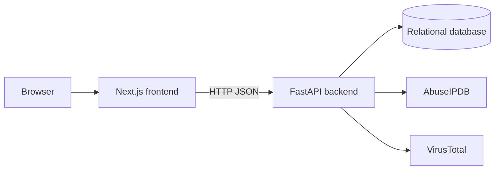

# ThreatLens AI - Deployment Guide

This document describes the deployment state of the current ThreatLens AI repository. It contains a runnable local FastAPI backend and Next.js frontend, but it does not contain a complete production deployment system. Commands marked as current are implemented by the repository; production recommendations are explicitly labeled.

## 1. Deployment Overview

The current application consists of:

- A Python/FastAPI backend from `backend/app/main.py`.
- A Next.js frontend from `frontend/`.
- A separately managed PostgreSQL-compatible relational database configured through `DATABASE_URL`.
- External AbuseIPDB and VirusTotal APIs called by the backend.



No cloud provider, reverse proxy, process manager, container image, Kubernetes manifest, Terraform configuration, or release pipeline exists in the repository.

## 2. Current Backend Deployment Requirements

The backend requires:

- Python 3.10 or newer. No exact Python version is pinned.
- Packages from `backend/requirements.txt`.
- A reachable relational database through `DATABASE_URL`; the dependency set is PostgreSQL/Psycopg-oriented.
- All settings declared in `backend/app/core/config.py`.
- Network access and valid credentials for AbuseIPDB and VirusTotal when using threat feeds or correlation.

The backend loads `.env` using `pydantic-settings` with `env_file=".env"`. Run backend and Alembic commands from `backend/` for the documented local setup.

## 3. Current Frontend Deployment Requirements

The frontend requires:

- Node.js compatible with Next.js `16.3.0`. No exact Node.js version or `engines` field is declared.
- npm and the committed `frontend/package-lock.json`.
- A browser-reachable backend URL.
- A successful Next.js production build.

The current production-shaped frontend commands are:

```bash
cd frontend
npm ci
npm run build
npm run start
```

`frontend/next.config.ts` currently exports an empty configuration object. There is no custom server, rewrite, proxy, static-export, or standalone-output configuration.

## 4. Database Deployment Requirements

The repository does not provision a database. Deployment must supply a PostgreSQL-compatible database, credentials, network access, backups, and operational monitoring.

`backend/app/db/database.py` creates the SQLAlchemy engine from `settings.DATABASE_URL`, creates `SessionLocal`, and provides the request-scoped `get_db` dependency. `backend/alembic/env.py` uses the same URL for migrations. The application does not create tables automatically or run migrations at startup.

## 5. Environment Variables and Secrets

Settings are declared in `backend/app/core/config.py`. Safe placeholder examples:

| Variable | Purpose | Secret? |
| --- | --- | --- |
| `APP_NAME` | FastAPI application name. | No |
| `APP_VERSION` | Application version metadata. | No |
| `APP_DESCRIPTION` | FastAPI description. | No |
| `DEBUG` | Debug setting; defaults to `false`. | No |
| `API_PREFIX` | Required configured prefix value; the router directly uses `/api/v1`. | No |
| `DATABASE_URL` | SQLAlchemy and Alembic database connection. | Yes, commonly contains credentials |
| `ABUSEIPDB_API_KEY` | AbuseIPDB credential. | Yes |
| `VIRUSTOTAL_API_KEY` | VirusTotal credential. | Yes |
| `JWT_SECRET_KEY` | JWT signing and validation secret. | Yes |
| `JWT_ALGORITHM` | JWT algorithm; defaults to `HS256`. | Security-sensitive |
| `ACCESS_TOKEN_EXPIRE_MINUTES` | JWT lifetime; defaults to `60`. | No |
| `NEXT_PUBLIC_API_URL` | Browser-visible API base URL used by selected frontend code. | No; do not put credentials in it |

Example format only:

```dotenv
DATABASE_URL=postgresql+psycopg://<user>:<password>@<host>:5432/<database>
ABUSEIPDB_API_KEY=<your-abuseipdb-key>
VIRUSTOTAL_API_KEY=<your-virustotal-key>
JWT_SECRET_KEY=<long-random-secret>
NEXT_PUBLIC_API_URL=https://api.example.invalid/api/v1
```

No `.env.example` is provided. Use protected deployment configuration for real values. Never commit environment files, API keys, database passwords, JWT secrets, access tokens, or password hashes.

## 6. External Provider Configuration

The active provider adapters are:

- AbuseIPDB: `ThreatFeedService.check_ip` in `backend/app/services/threat_feed_service.py`.
- VirusTotal: `VirusTotalService.check_ip` in `backend/app/services/virus_total_service.py`.

Both use HTTPS and an HTTPX timeout of 10 seconds. Correlation can return a result when one provider fails, but returns `503` when both are unavailable. Provider keys are loaded from settings and are not stored in the database.

There is no key rotation, quota monitoring, provider health check, or deployment-specific provider configuration in the repository.

## 7. Backend Startup Command

Current local development command:

```bash
cd backend
source .venv/bin/activate
uvicorn app.main:app --reload
```

The same application can run without reload:

```bash
cd backend
source .venv/bin/activate
uvicorn app.main:app
```

The no-reload command is the closest current production-shaped invocation. The repository does not define a production worker count, process supervisor, restart policy, resource limit, or managed service configuration. Do not use `--reload` for production.

## 8. Frontend Build and Startup Commands

From `frontend/`:

```bash
npm ci
npm run build
npm run start
```

Available scripts from `frontend/package.json` are `dev`, `build`, `start`, and `lint`. The default Next.js development URL is `http://localhost:3000`. `npm run start` normally serves the build on that port after `npm run build` succeeds.

## 9. Database Migration and Deployment Steps

With the target database URL available and the virtual environment active, run from `backend/`:

```bash
alembic upgrade head
alembic current
alembic heads
```

The migration chain currently creates `iocs`, `threat_analyses`, and `users`. Migration configuration is in `backend/alembic.ini`; runtime URL and model metadata are configured by `backend/alembic/env.py`.

Running migrations before application startup is a recommended release practice, not an automated repository behavior. Review migration changes and coordinate backups before applying them to shared data.

## 10. Production Configuration Considerations

Recommended production work, not currently configured, includes:

- Set `DEBUG=false` and use a strong environment-specific JWT secret.
- Inject secrets through a protected secret store or deployment environment.
- Use a database with backups, restricted access, monitoring, and a recovery plan.
- Apply migrations as a controlled release step.
- Run the backend without `--reload` under a process supervisor or equivalent managed runtime.
- Replace the localhost-only CORS allowlist in `backend/app/main.py` with the actual trusted frontend origin.
- Correct the inconsistent frontend API URL handling; IOC and Threat Feed pages hard-code the local backend URL.
- Review SQL logging: the SQLAlchemy engine uses `echo=True` in `backend/app/db/database.py`.
- Add readiness, metrics, operational logging, provider monitoring, and rollback procedures.

## 11. CORS and Frontend-Backend Communication

`backend/app/main.py` configures CORS with:

- `http://localhost:3000` and `http://127.0.0.1:3000` as allowed origins.
- `allow_credentials=True`.
- All methods and headers allowed.

This is a local configuration. A deployed frontend origin is not allowed by the current source unless CORS is changed.

The browser calls the API directly with JSON `fetch` requests. `NEXT_PUBLIC_API_URL` is read by some pages, while IOC and Threat Feed pages use hard-coded `http://127.0.0.1:8000` URLs. No frontend proxy or rewrite is configured.

IOC, threat-feed, and threat-analysis backend routes require JWT bearer authentication. `AuthGuard` sends a token for `/api/v1/auth/me`, but several feature-page requests currently omit the bearer header. This is an existing integration gap that must be resolved before relying on the protected UI in production.

## 12. HTTPS and Security Considerations

The repository does not configure HTTPS, TLS certificates, redirects, secure cookies, reverse-proxy headers, or security headers. The application processes serve HTTP directly.

Recommended production practices are:

- Terminate HTTPS at a trusted edge or reverse proxy.
- Configure the deployed frontend origin explicitly in CORS.
- Keep database, provider, and JWT secrets outside the repository.
- Restrict database access to backend and migration runtimes.
- Review `echo=True` before production because SQL statements may contain sensitive values.
- Monitor authentication failures and provider errors.
- Review frontend token storage and ensure all protected requests send the bearer token.

These controls are not currently implemented by this repository.

## 13. Health Checks and Verification

Current public checks:

```bash
curl http://127.0.0.1:8000/
curl http://127.0.0.1:8000/api/v1/health
```

`GET /` returns project, status, and version metadata. `GET /api/v1/health` returns a static healthy response. It does not check the database or provider APIs.

FastAPI documentation is available at:

- `http://127.0.0.1:8000/docs`
- `http://127.0.0.1:8000/redoc`

For a database-backed check after migrations, register a local test user through `POST /api/v1/auth/register`, then test login and `/api/v1/auth/me`. There is no implemented readiness, metrics, database-health, provider-health, or smoke-test endpoint.

## 14. Deployment Verification Checklist

- [ ] Required backend settings are injected without exposing secrets.
- [ ] Backend dependencies install from `backend/requirements.txt`.
- [ ] `DATABASE_URL` reaches the intended database.
- [ ] `alembic upgrade head` completes and `alembic current` is expected.
- [ ] Backend starts with `uvicorn app.main:app` without `--reload`.
- [ ] `/` and `/api/v1/health` respond.
- [ ] Frontend `npm run build` succeeds.
- [ ] Frontend `npm run start` serves the built application.
- [ ] Browser requests use the deployed API URL.
- [ ] CORS allows only the intended frontend origin.
- [ ] Registration, login, and `/api/v1/auth/me` work.
- [ ] Protected IOC and analysis requests include bearer authentication.
- [ ] Provider lookups work with deployment credentials, or failure behavior is understood.
- [ ] No local environment files, tokens, credentials, or debug artifacts are in the release.
- [ ] HTTPS termination, secret storage, backups, and monitoring are supplied externally.

## 15. Local-to-Production Differences

| Area | Current local behavior | Production consideration |
| --- | --- | --- |
| Backend | Uvicorn with optional `--reload` on port 8000. | Use a managed no-reload process. |
| Frontend | Next.js development server on port 3000. | Build first and serve with `npm run start`. |
| CORS | Two localhost origins. | Configure the real frontend origin. |
| API URL | Mixed environment-variable and hard-coded local URLs. | Centralize and deploy the API URL correctly. |
| Database | Separately managed; migrations run manually. | Supply backups, access controls, and controlled migrations. |
| Secrets | Local ignored `.env`. | Use protected secret injection and rotation. |
| HTTPS | Not configured. | Supply TLS termination externally. |
| Health | Static root and health responses. | Add or supply real readiness/health checks. |
| Automation | No deployment scripts or CI/CD. | Build the release process externally. |

## 16. Docker and Deployment Configuration That Exists

The root `docker-compose.yml` is empty. The `docker/` directory is empty. There are no Dockerfiles, images, services, volumes, networks, container health checks, or container environment definitions.

Consequently, Docker commands such as `docker compose up` do not represent a supported deployment path for the current repository. Any container deployment would be new infrastructure.

## 17. Current CI/CD Configuration

`.github/workflows/.gitkeep` is the only file under `.github/workflows/`. There are no GitHub Actions jobs, build checks, test jobs, migration jobs, deployment jobs, release workflows, or environment configurations. The `scripts/` directory is also empty.

## 18. Recommended Deployment Workflow

The following is a recommendation, not an implemented pipeline:

1. Build a reviewed release from `main`.
2. Install backend and frontend dependencies from their manifests/lockfile.
3. Inject environment variables through protected deployment configuration.
4. Verify database access and run `alembic upgrade head`.
5. Start the backend with a managed no-reload ASGI process.
6. Run `npm run build` and serve with `npm run start`.
7. Configure the real frontend origin and reachable API URL.
8. Verify root, health, auth, database-backed routes, and provider behavior.
9. Route HTTPS traffic after smoke checks pass.
10. Monitor logs and retain application/database rollback procedures.

The repository does not automate these steps.

## 19. Current Deployment Limitations and Missing Infrastructure

- No Dockerfile or working Compose configuration.
- No cloud, Kubernetes, Terraform, or infrastructure-as-code files.
- No CI/CD, deployment scripts, process-manager configuration, or release automation.
- No exact Python or Node.js runtime pin.
- No `.env.example` or deployment configuration template.
- Localhost-only CORS and inconsistent frontend API URL configuration.
- Frontend protected requests do not consistently attach JWT headers.
- No HTTPS, reverse proxy, certificate, security-header, or redirect configuration.
- No database provisioning, backup, restore, pool, or readiness configuration.
- Migrations are manual and are not run at startup.
- Health endpoints are static and do not verify database/provider availability.
- SQLAlchemy `echo=True` requires production review.
- No provider key rotation, quota monitoring, or credential health check.
- No automated tests or deployment smoke-test suite.

## 20. Troubleshooting Common Deployment Failures

### Backend fails during startup

Check every required setting in `backend/app/core/config.py`, including database, provider, application, and JWT values. Run from `backend/` so the configured `.env` lookup works.

### Migrations cannot connect

Verify that the database is running, `DATABASE_URL` is correct, the Psycopg URL is valid, and the database is reachable from the migration runtime:

```bash
cd backend
alembic upgrade head
```

### Browser reports CORS errors

The current allowlist contains only `http://localhost:3000` and `http://127.0.0.1:3000`. A deployed frontend origin requires a backend CORS configuration change.

### Frontend calls localhost after deployment

Check `NEXT_PUBLIC_API_URL`, then inspect page code. The IOC and Threat Feed pages currently hard-code `http://127.0.0.1:8000`; environment configuration alone cannot change those pages in the current implementation.

### Protected requests return 401

Confirm login and `/api/v1/auth/me`, then inspect the request for `Authorization: Bearer <token>`. The backend requires this header for IOC, feed, and analysis routes, and current feature pages do not consistently provide it.

### Provider lookups fail

Check provider credentials, outbound HTTPS, rate limits, and the 10-second timeout. Correlation can use one successful provider; both failing results in `503` and no saved analysis.

### Health is green but the application is unavailable

The health endpoint is static. Separately verify database migrations, registration/login, protected routes, frontend access, and provider lookups.
